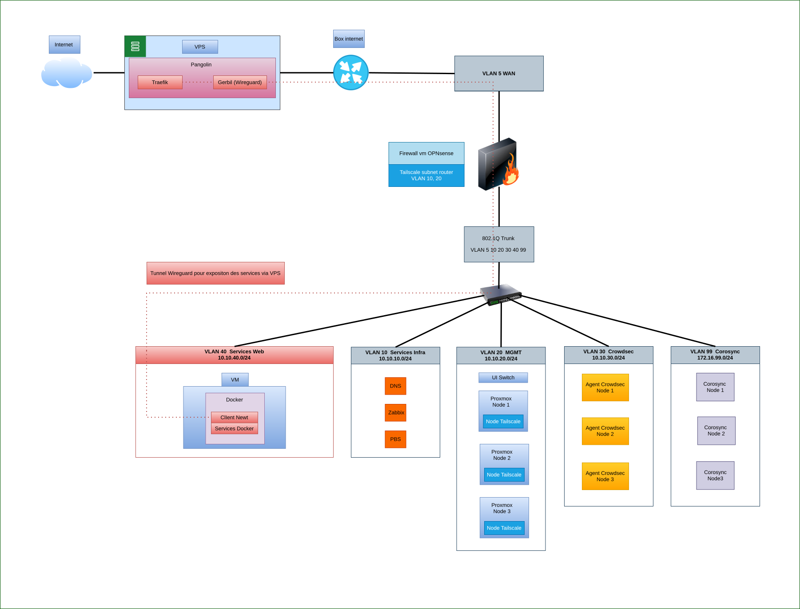

# Homelab Cluster Proxmox

        

Lab infra personnel, en production, en évolution!
## 📚 Sommaire

- [Homelab Cluster Proxmox](#homelab-cluster-proxmox)
  - [📚 Sommaire](#-sommaire)
  - [🎯 Objectifs techniques](#-objectifs-techniques)
  - [🏛️ Résumé d'architecture](#️-résumé-darchitecture)
  - [🌐 Schéma de l'infrastructure](#-schéma-de-linfrastructure)
  - [🛠️ Compétences mobilisées](#️-compétences-mobilisées)
  - [⚙️ Choix technologiques](#️-choix-technologiques)
  - [📂 Documentation technique](#-documentation-technique)

## 🎯 Objectifs techniques

- Déployer un cluster Proxmox 3 nœuds en haute disponibilité
- Mettre en place une segmentation réseau par VLAN
- Sécuriser l'infrastructure (firewall, IDS, CrowdSec, Zero Trust)
- Exposer des services via reverse proxy (VPS + Pangolin)
- Mettre en place la supervision et les alertes (Zabbix/Telegram)
- Monitoring de disponibilité des services exposés (Uptime Kuma)
- Mettre en place les sauvegardes (PBS)

## 🏛️ Résumé d'architecture

- Virtualisation : Cluster Proxmox 3 nœuds (HA Manager + réplication ZFS)
- Stockage : ZFS + réplication inter-nœuds (bidirectionnelle par datasets)
- VLAN 5 : WAN
- VLAN 10 : Services infra + apps internes
- VLAN 20 : Management Proxmox + UI switch
- VLAN 30 : Communication CrowdSec (Agents -> LAPI sur OPNsense)
- VLAN 40 : Services docker exposés via Pangolin (client newt)
- VLAN 99 : Corosync isolé
- VLAN 4094 : Blackhole
- DNS interne : Unbound -> AdGuard Home -> DoH (Quad9)
- Sécurité : OPNsense + IDS (Suricata) + CrowdSec centralisé
- Exposition des services via VPS + Pangolin (Traefik + Wireguard)
- Accès distant sécurisé : Tailscale
- Sauvegardes : PBS + stratégie 3-2-1 (en cours)

> Note : VLAN 100 : DMZ - non utilisé (architecture migrée vers VPS + Pangolin)

## 🌐 Schéma de l'infrastructure

## 🛠️ Compétences mobilisées

- Mise en place d'un cluster Proxmox (VM, LXC, HA Manager, Affinity Rules)
- Utilisation de ZFS (mirror, réplication, snapshots)
- Segmentation réseau par VLAN et configuration de switch manageable
- Déploiement et administration d'un firewall OPNsense
- Supervision avec Zabbix (agents, alertes Telegram)
- Monitoring de disponibilité des services (Uptime Kuma, alertes Telegram)
- Sécurisation des accès (SSH par clés, Tailscale, CrowdSec)
- DNS interne avec filtrage (AdGuard Home, DoH)
- Déploiement de conteneurs Docker
- Documentation technique structurée
- Gestion d'un VPS pour exposer les services Docker
- Reverse proxy
- Wireguard

## ⚙️ Choix technologiques

- __Proxmox__ : Solution open-source basée sur Debian, adaptable à un matériel hétérogène
- __ZFS__ : Intégrité des données, snapshots et réplication inter-nœuds
- __OPNsense__ : Firewall open-source communautaire, alternative à pfSense - utilisation des plugins (CrowdSec, Suricata, Tailscale)
- __CrowdSec__ : Protection collaborative et moderne, LAPI centralisée sur OPNsense et indépendante sur VPS
- __AdGuard Home__ : Filtrage DNS avec DoH vers Quad9
- __Zabbix__ : Supervision open-source reconnue, alertes Telegram
- __Pangolin__ : Solution moderne regroupant un reverse proxy traefik, routage dynamique, TLS automatique (Let's Encrypt), wireguard
- __Uptime Kuma__ : Monitoring de disponibilité des services exposés, alertes Telegram
- __Tailscale__ : Accès distant Zero Trust sans exposition de ports
- __PBS__ : Proxmox Backup Server - sauvegardes et tests de restauration
- __Docker__ : Déploiement de conteneurs applicatifs (Wiki.js, etc.)

## 📂 Documentation technique

- [Architecture](Ressources/Docs/architecture.md)
- [Configuration réseau](Ressources/Docs/configuration_reseau.md)
- [Guide d'installation](Ressources/Docs/install.md)
- [Hardware](Ressources/Docs/hardware.md)